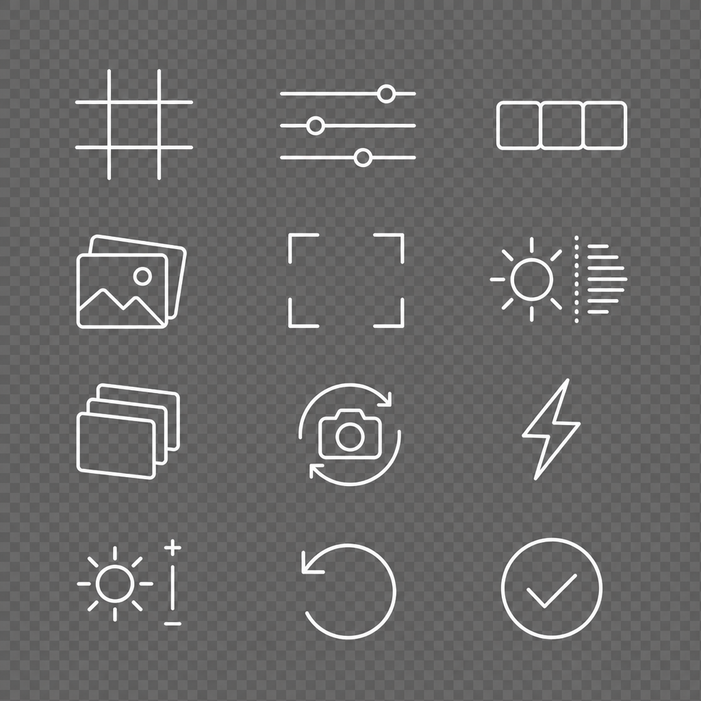
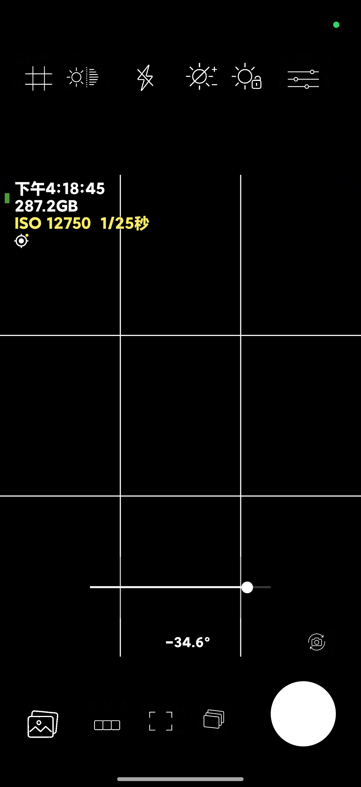
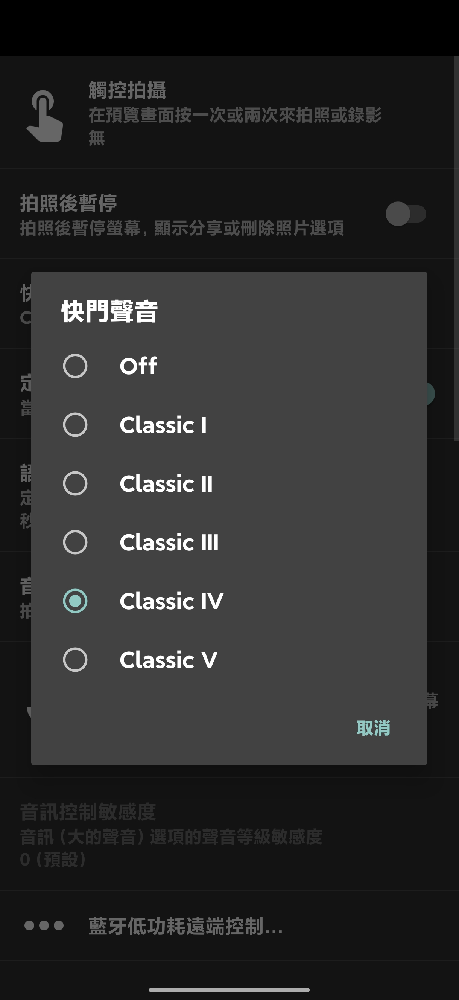
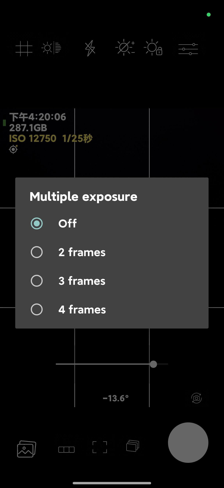
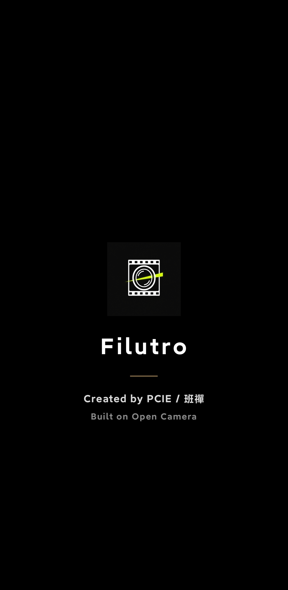
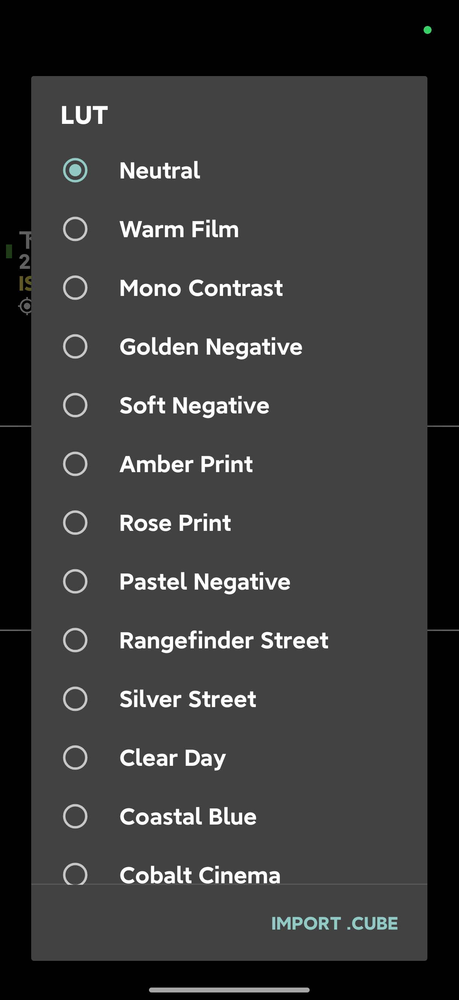
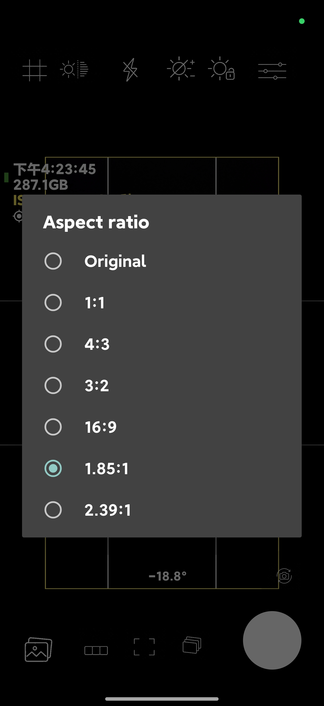
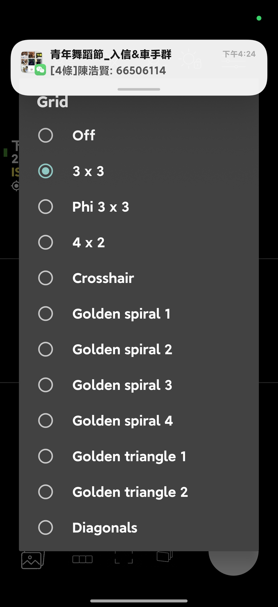

# Filutro

[繁體中文](#繁體中文) | [English](#english)

## Screenshots / 介面展示

  

Filutro 的圖標、AI 圖標設計稿與實機介面展示：主拍攝、可選快門聲、多重曝光、即時 LUT／`.cube` 匯入、畫幅及格線。

  

  
  
  

  
  
  

  

## 繁體中文

Filutro 是一款基於 [Open Camera](https://opencamera.org.uk/) 深度改造的純拍照 Android 相機應用。它以 Panasonic LUMIX S9 的即時 LUT 拍攝概念為參考，精簡非必要功能，將體驗收斂至攝影本身，並直接輸出已套用色彩風格的 JPEG 相片。

### 基礎與定位

Filutro 並不是從零開始重寫相機核心，而是基於 [Open Camera](https://opencamera.org.uk/) 深度修改而成的衍生作品。Open Camera 提供相機控制、自動對焦、拍攝、影像儲存與跨裝置相容性的成熟基礎；Filutro 則在此之上精簡非必要功能，將介面與工作流程收斂至靜態攝影創作。

### 功能

- Panasonic LUMIX S9 式即時 LUT 預覽與已套用 LUT 的 JPEG 直出
- 40 款內建色彩風格，支援匯入 `.cube` LUT
- 可選與可自訂的快門聲，以及拍攝震動與畫面閃動回饋
- 最多 4 張多重曝光及殘影引導預覽
- 為攝影工作流程重新設計的圖標與拍攝控制 UI
- 畫幅：1:1、4:3、3:2、16:9、1.85:1、2.39:1
- 格線、變焦、曝光調整和曝光鎖定
- Android 原生相機控制基礎，優先保留裝置相容性

### 拍攝範圍

Filutro 專注於靜態相片。拍攝時可預覽 LUT、格線與畫幅，輸出的 JPEG 已直接套用所選色彩風格。錄影與 RAW 工作流程不屬於本專案範圍，讓介面與效能資源集中於拍照體驗。

### 安裝

從 [Releases](../../releases) 下載最新的 APK，傳送至 Android 手機後安裝。

### 權限與相片資料

- **相機**：用於即時預覽與拍照。
- **定位**：僅在使用者授權後寫入相片 EXIF 的地理位置資料。
- **相片儲存**：相片儲存在裝置的媒體資料庫中。

目前的 Android Manifest 仍保留部分從 Open Camera 繼承的藍牙與錄音權限宣告。它們正在逐項檢視與收斂；在沒有對應的選用功能需求時，不應授予這些權限。

### 從原始碼建置

1. 下載並解壓縮根目錄的原始碼 ZIP。
2. 使用 Android Studio 開啟專案。
3. 使用 JDK 17 與 Android SDK API 36 建置；專案最低支援 Android 6.0（API 23）。

### 已測試裝置

以下裝置已完成安裝與基本拍攝流程測試：

- Android 模擬器（型號未記錄）
- Xiaomi 17 Pro、Xiaomi 17 Max、Xiaomi 17 Ultra
- Xiaomi Pad 7S Pro
- Samsung Galaxy S22
- Redmi K40、Redmi K30
- Black Shark 4S
- Sony Xperia XZ2 Compact

### 已知限制

- **Sony Xperia XZ2 Compact**：啟用 Open Camera 內建運算演算法時，曾觀察到嚴重發熱。這可能與裝置的運算負載及散熱餘裕有關，尚未完成根因分析；長時間拍攝時建議停用該模式並留意機身溫度。

### 原始碼

完整 Android 原始碼位於根目錄的 [Filutro-source-gpl-3.0.zip](./Filutro-source-gpl-3.0.zip)。下載解壓後可用 Android Studio 開啟並建置。

### 授權與致謝

Filutro 建構於 [Open Camera](https://opencamera.org.uk/) 的開源程式碼之上，依 **GNU General Public License v3.0 or later** 發佈。完整授權條款與來源說明包含在原始碼壓縮檔內。

建構：@PCIE/班禪

### 回報問題

請在 [Issues](../../issues) 回報問題，並附上裝置型號、Android 版本、使用的鏡頭、LUT、HDR／多重曝光狀態、重現步驟與示例相片（移除私人資料後）。不同 Android 裝置的相機行為差異很大，這些資訊對修正相容性問題很重要。

---

## English

Filutro is a photo-only Android camera app deeply modified from [Open Camera](https://opencamera.org.uk/). Inspired by Panasonic LUMIX S9's real-time LUT shooting concept, it removes non-essential features, keeps the experience focused on photography, and saves JPEG photos with the selected color look already applied.

### Foundation and Direction

Filutro is not a camera core rewritten from scratch. It is a modified derivative of [Open Camera](https://opencamera.org.uk/). Open Camera provides the mature foundations for camera control, autofocus, capture, image saving, and cross-device compatibility; Filutro streamlines non-essential features and focuses the interface and workflow on still photography.

### Features

- Panasonic LUMIX S9-style real-time LUT preview with baked-in JPEG output
- 40 built-in color looks and `.cube` LUT import support
- Selectable, customizable shutter sounds with vibration and screen-flash capture feedback
- Up to four-frame multiple exposure with a ghost-image guide
- Rebuilt icons and shooting controls designed around a photography-focused workflow
- Aspect ratios: 1:1, 4:3, 3:2, 16:9, 1.85:1, and 2.39:1
- Grids, zoom, exposure adjustment, and exposure lock
- Native Android camera controls with a focus on device compatibility

### Photo-Only Scope

Filutro focuses on still photos. LUTs, grids, and aspect ratios can be previewed during capture, and the selected color look is applied directly to the exported JPEG. Video and RAW workflows are intentionally outside this project's scope so the interface and performance budget stay focused on photography.

### Installation

Download the latest APK from [Releases](../../releases), transfer it to an Android device, and install it.

### Permissions and Photo Metadata

- **Camera**: required for the live preview and photo capture.
- **Location**: written to photo EXIF geotags only after the user grants permission.
- **Photo storage**: photos are saved to the device media library.

The current Android Manifest still contains Bluetooth and microphone permission declarations inherited from Open Camera. They are being reviewed and reduced one by one; do not grant them unless an optional feature specifically requires them.

### Building from Source

1. Download and extract the source ZIP in the repository root.
2. Open the project with Android Studio.
3. Build with JDK 17 and Android SDK API 36. The project supports Android 6.0 (API 23) and newer.

### Tested Devices

The following environments have completed installation and basic photo-capture workflow testing:

- Android Emulator (model not recorded)
- Xiaomi 17 Pro, Xiaomi 17 Max, Xiaomi 17 Ultra
- Xiaomi Pad 7S Pro
- Samsung Galaxy S22
- Redmi K40, Redmi K30
- Black Shark 4S
- Sony Xperia XZ2 Compact

### Known Limitation

- **Sony Xperia XZ2 Compact**: severe heating has been observed when Open Camera's built-in computational algorithms are enabled. The cause has not been confirmed; it may be related to device compute load and thermal headroom. Disable this mode for extended shooting and monitor device temperature.

### Source Code

The complete Android source tree is available as [Filutro-source-gpl-3.0.zip](./Filutro-source-gpl-3.0.zip) in the repository root. Extract it and open the project with Android Studio to build it.

### Reporting Issues

Report issues through [Issues](../../issues). Include the device model, Android version, active camera lens, LUT, HDR or multiple-exposure state, reproduction steps, and sample photos with private information removed. Camera behavior varies substantially across Android devices, so this information is essential for compatibility fixes.

### License and Credits

Filutro is derived from the open-source code of [Open Camera](https://opencamera.org.uk/) and is released under the **GNU General Public License v3.0 or later**. The complete license and source attribution are included in the source archive.

Built by @PCIE/班禪
